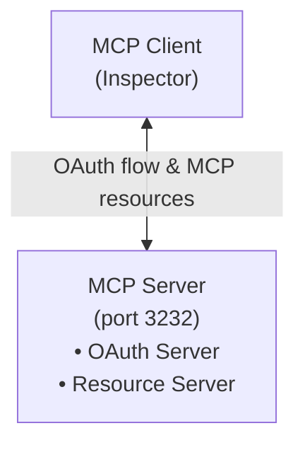
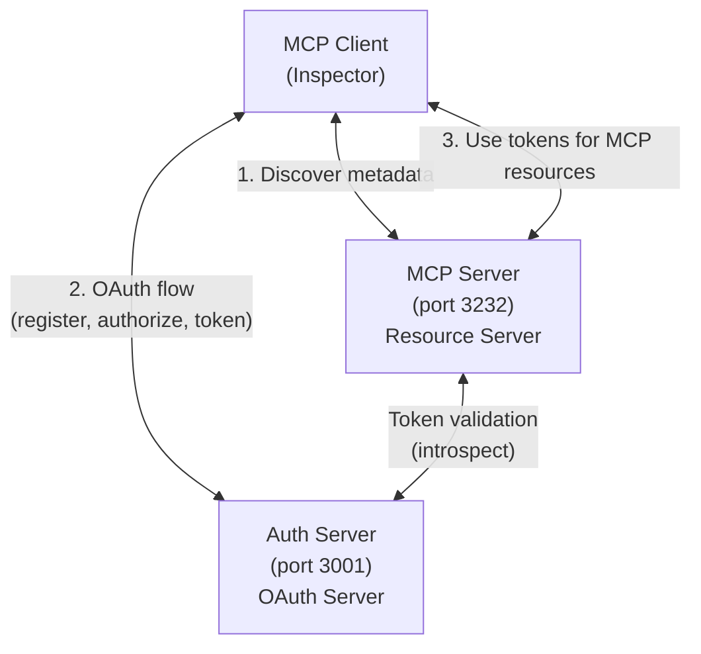

# MCP Feature Reference Server

_Note: these docs were AI generated based on a claude code transcript, and then edited manually for accuracy_

A comprehensive example implementation of a scalable Model Context Protocol (MCP) server that demonstrates all MCP functionality with full authentication support and horizontal scalability.

## Overview

The Feature Reference Server is an open-source reference implementation that showcases:
- **Complete [MCP Protocol](https://modelcontextprotocol.io/specification) Support**: All MCP features including tools, resources, prompts, sampling, completions, and logging
- **Multiple [Transport Methods](https://modelcontextprotocol.io/docs/concepts/transports)**: Streamable HTTP (SHTTP) and Server-Sent Events (SSE)
- **Dual Authentication Modes**: Integrated and separate authorization server support
- **Horizontal Scalability**: Redis-backed session management for multi-instance deployments

This server serves as both primarily as a learning resource, and an example implementation of a scalable remote MCP server.

## Repository Structure

This repository contains **two complete, standalone implementations** to help you learn different MCP deployment patterns:

```
embedded-oauth/          # Complete example: MCP server with integrated OAuth
  └── src/                # All code in one place, ready to run

external-oauth/
  ├── auth-server/        # Standalone OAuth authorization server
  │   └── src/
  └── mcp-server/         # MCP server that delegates to external auth
      └── src/
```

Both modes are complete, independently buildable implementations with full test coverage. For more information on the difference between embedded and external OAuth, see [Authentication Modes](#authentication-modes).

## Quick Start

Get the server running in 5 minutes:

```bash
# 1. Prerequisites
brew install orbstack       # macOS: Install OrbStack (skip if already installed)
orbctl start                # macOS: Start OrbStack daemon
# OR install Docker Desktop and start it (Windows/Linux/macOS alternative)

# 2. Setup
git clone https://github.com/modelcontextprotocol/example-remote-server.git
cd example-remote-server
npm install                 # Install dependencies for all workspaces

# 3. Start services
docker compose up -d        # Start Redis
npm run dev:embedded      # Start embedded-oauth server
# OR
npm run dev:external        # Start both auth-server and mcp-server

# 4. Test with Inspector
npx -y @modelcontextprotocol/inspector
# Connect to http://localhost:3232/mcp
```

For detailed instructions, see [Installation](#installation).

## Table of Contents

- [Quick Start](#quick-start)
- [Features](#features)
- [Installation](#installation)
- [Configuration](#configuration)
- [Authentication Modes](#authentication-modes)
- [Development](#development)
  - [Testing with MCP Inspector](#testing-with-mcp-inspector)
  - [Automated End-to-End Testing](#automated-end-to-end-testing)
  - [Interactive Testing](#interactive-testing)
- [Troubleshooting](#troubleshooting)
- [Architecture & Technical Details](#architecture--technical-details)
- [API Reference](#api-reference)
- [Security](#security)
- [Monitoring & Debugging](#monitoring--debugging)
- [Contributing](#contributing)

## Features

### MCP Protocol Features
- **[Tools](https://modelcontextprotocol.io/docs/concepts/tools)**: 7 demonstration tools including echo, add, long-running operations, LLM sampling, image handling, annotations, and resource references
- **[Resources](https://modelcontextprotocol.io/docs/concepts/resources)**: 100 example resources with pagination, templates, and subscription support
- **[Prompts](https://modelcontextprotocol.io/docs/concepts/prompts)**: Simple and complex prompts with argument support and resource embedding
- **[Sampling](https://modelcontextprotocol.io/docs/concepts/sampling)**: Integration with MCP sampling for LLM interactions
- **Completions**: Auto-completion support for prompt arguments
- **Logging**: Multi-level logging with configurable verbosity
- **Notifications**: Progress updates, resource updates, and stderr messages

### Transport & Infrastructure
- **[Streamable HTTP](https://modelcontextprotocol.io/specification/2025-03-26/basic/transports#streamable-http)**: Full implementation with GET/POST/DELETE support
- **[SSE Transport](https://modelcontextprotocol.io/specification/2025-03-26/basic/transports#server-sent-events)**: Backwards-compatible Server-Sent Events
- **Redis Integration**: Pub/sub message routing and session state management
- **Session Management**: 5-minute TTL with automatic cleanup
- **Horizontal Scaling**: Any instance can handle any request

### Authentication & Security
- **Dual Mode Support**: Run with integrated or separate authorization server
- **[OAuth 2.0](https://modelcontextprotocol.io/specification/2025-03-26/basic/authorization)**: Complete authorization flow with PKCE support
- **External Auth Ready**: Demonstrates integration with external OAuth providers
- **Session Ownership**: User isolation and access control  
- **Security Headers**: CSP, HSTS, X-Frame-Options, and more
- **Bearer Token Auth**: Middleware for protected endpoints

## Installation

### Prerequisites
- Node.js >= 16
- npm or yarn
- Docker runtime (for Redis)

### Step 1: Install Docker Runtime
Choose one option:

**macOS (Recommended: OrbStack)**
```bash
brew install orbstack
# Start OrbStack daemon (required before using Docker commands)
orbctl start
# Or download from https://orbstack.dev/download
```

**Windows/Linux: Docker Desktop**
- Download from https://www.docker.com/products/docker-desktop
- Start Docker Desktop after installation

**Alternative: Local Redis Installation**
```bash
# macOS
brew install redis && brew services start redis

# Ubuntu/Debian
sudo apt-get install redis-server && sudo systemctl start redis
```

### Step 2: Clone and Install Dependencies
```bash
git clone https://github.com/modelcontextprotocol/example-remote-server.git
cd example-remote-server
npm install  # Installs dependencies for all workspaces (embedded-oauth, auth-server, mcp-server)
```

### Step 3: Choose Your Mode
The repository includes two complete, standalone examples:

**Option A: Embedded OAuth (Simpler)**
```bash
cd embedded-oauth
# Everything is configured by default in .env
```

**Option B: External OAuth (Production-like)**
```bash
cd external-oauth/auth-server  # Auth server configuration in .env
cd external-oauth/mcp-server   # MCP server configuration in .env
```

### Step 4: Start Redis
```bash
# Ensure Docker/OrbStack is running first!
docker compose up -d

# Verify Redis is running
docker compose ps
```

### Step 5: Start and Verify

**Embedded OAuth:**
```bash
npm run dev:embedded
# Server starts on http://localhost:3232
```

**External OAuth:**
```bash
npm run dev:external
# Auth server starts on http://localhost:3001
# MCP server starts on http://localhost:3232
```

## Configuration

Each mode has its own `.env` file pre-configured:

**Embedded OAuth** (`embedded-oauth/.env`):
```bash
BASE_URI=http://localhost:3232     # MCP server URL
PORT=3232                          # MCP server port
REDIS_URL=redis://localhost:6379   # Redis connection
```

**External OAuth Auth Server** (`external-oauth/auth-server/.env`):
```bash
AUTH_SERVER_URL=http://localhost:3001  # Auth server URL
AUTH_SERVER_PORT=3001                  # Auth server port
BASE_URI=http://localhost:3232         # MCP server URL (for redirects)
REDIS_URL=redis://localhost:6379       # Redis connection
```

**External OAuth MCP Server** (`external-oauth/mcp-server/.env`):
```bash
BASE_URI=http://localhost:3232         # MCP server URL
PORT=3232                              # MCP server port
AUTH_SERVER_URL=http://localhost:3001  # External auth server URL
REDIS_URL=redis://localhost:6379       # Redis connection
```

## Authentication Modes

Per the [MCP Authorization specification](https://modelcontextprotocol.io/specification/2025-06-18/basic/authorization), the authorization server may be hosted with the resource server or as a separate entity. This repository demonstrates both patterns.

### Embedded OAuth
**Location**: `embedded-oauth/`

OAuth authorization server hosted with the MCP resource server. Demonstrates self-hosted OAuth with upstream identity provider delegation (enterprise pattern where you control OAuth but delegate user authentication to corporate SSO/LDAP).

```bash
npm run dev:embedded  # Single server on :3232
```

See [embedded-oauth/README.md](embedded-oauth/README.md) for details.

### External OAuth
**Location**: `external-oauth/`

MCP resource server using a completely separate OAuth authorization server. Demonstrates the OAuth-as-a-Service pattern (modern SaaS pattern using Auth0, Okta, or similar providers).

```bash
npm run dev:external  # Auth server on :3001, MCP server on :3232
```

See [external-oauth/README.md](external-oauth/README.md) for architecture and implementation details.

## Development

```bash
# Start servers
npm run dev:embedded        # Embedded OAuth
npm run dev:external        # External OAuth (both servers)
npm run dev:auth-server     # External OAuth - auth server only
npm run dev:mcp-server      # External OAuth - MCP server only
```

### Build & Production
```bash
npm run build               # Build all workspaces
npm run build:embedded      # Build embedded OAuth only
npm run build:external      # Build external OAuth only

npm run start:embedded      # Run embedded OAuth
npm run start:external      # Run external OAuth (both servers)
```

### Testing & Quality
```bash
npm test                    # All unit tests (189 total)
npm run lint                # Lint all code
npm run typecheck           # Typecheck all code

npm run test:e2e            # Run all e2e tests
npm run test:e2e:embedded   # E2E test for embedded OAuth
npm run test:e2e:external   # E2E test for external OAuth
```

### Testing with MCP Inspector

The MCP Inspector is a web-based tool for testing MCP servers.

#### Prerequisites
1. Ensure Docker/OrbStack is running
2. Ensure Redis is running: `docker compose ps`

#### Test Embedded OAuth
```bash
# 1. Start the server (Redis must already be running)
npm run dev:embedded

# 2. Launch MCP Inspector in a new terminal
npx -y @modelcontextprotocol/inspector

# 3. Connect to: http://localhost:3232/mcp
# 4. Navigate to Auth tab and complete OAuth flow
```

#### Test External OAuth
```bash
# 1. Start both servers (Redis must already be running)
npm run dev:external

# 2. Launch MCP Inspector in a new terminal
npx -y @modelcontextprotocol/inspector

# 3. Connect to: http://localhost:3232/mcp
# 4. Auth flow will redirect to :3001 for authentication
```

### Test Categories
- **Unit Tests**: Component testing (189 tests across all workspaces)
- **Integration Tests**: Transport and Redis integration
- **E2E Tests**: Complete OAuth + MCP feature verification

### End-to-End Testing

E2E scripts in `scripts/` verify complete OAuth flows and MCP features:

```bash
npm run test:e2e:embedded    # Test embedded OAuth
npm run test:e2e:external    # Test external OAuth
npm run test:e2e               # Run both
```

Scripts automatically manage server lifecycle, test OAuth 2.0 + PKCE flow, and verify all MCP features.

## Troubleshooting

### Common Issues

**"Cannot connect to Docker daemon"**
- Ensure Docker Desktop or OrbStack daemon is running
- macOS with OrbStack: `orbctl start` (verify with `orbctl status`)
- Windows/Linux/macOS with Docker Desktop: Start Docker Desktop application

**"Redis connection refused"**
- Check Redis is running: `docker compose ps`
- If not running: `docker compose up -d`
- Ensure Docker/OrbStack is started first

**"Missing .env file"**
- Each mode directory has a pre-configured `.env` file
- embedded-oauth/.env, external-oauth/auth-server/.env, external-oauth/mcp-server/.env

**"Port already in use"**
- Check for existing processes: `lsof -i :3232` or `lsof -i :3001`
- Kill existing processes or change PORT in .env

**"npm install fails"**
- Ensure Node.js >= 16 is installed: `node --version`
- Clear npm cache: `npm cache clean --force`
- Delete node_modules and package-lock.json, then retry

**"Authentication flow fails"**
- Check server logs for error messages
- Ensure Redis is running: `docker compose ps`
- Verify .env configuration in the mode directory you're running

## Architecture & Technical Details

### Authentication Architecture

#### Embedded OAuth


#### External OAuth


### OAuth Flow

Both modes implement OAuth 2.1 with PKCE. For detailed flow analysis including data storage, TTLs, and mode-specific differences, see [docs/oauth-flow.md](docs/oauth-flow.md).

### Project Structure
```
├── embedded-oauth/              # Complete integrated auth example
│   ├── src/
│   │   ├── index.ts             # Main entry point (MCP + OAuth)
│   │   ├── auth/
│   │   │   ├── provider.ts      # FeatureReferenceAuthProvider
│   │   │   └── auth-core.ts     # Token generation, PKCE
│   │   ├── services/
│   │   │   ├── mcp.ts           # MCP server implementation
│   │   │   ├── auth.ts          # Auth service wrappers
│   │   │   ├── redis-auth.ts    # Redis auth operations
│   │   │   └── redisTransport.ts # Redis-backed transport
│   │   ├── handlers/            # SHTTP, SSE, mock-upstream-idp handlers
│   │   ├── utils/logger.ts      # Structured logging
│   │   └── ...
│   ├── package.json
│   ├── tsconfig.json
│   └── .env
│
├── external-oauth/
│   ├── auth-server/             # Standalone OAuth server
│   │   ├── src/
│   │   │   ├── index.ts         # Auth server entry point
│   │   │   ├── auth/
│   │   │   │   ├── provider.ts  # FeatureReferenceAuthProvider
│   │   │   │   └── auth-core.ts
│   │   │   ├── services/        # Auth services, redis-auth
│   │   │   ├── handlers/        # Mock upstream auth
│   │   │   └── ...
│   │   ├── package.json
│   │   └── .env
│   │
│   └── mcp-server/              # MCP server with external auth
│       ├── src/
│       │   ├── index.ts         # MCP server entry point
│       │   ├── auth/
│       │   │   ├── external-verifier.ts  # Token introspection
│       │   │   └── auth-core.ts
│       │   ├── services/        # MCP server, redisTransport
│       │   ├── handlers/        # SHTTP, SSE handlers
│       │   └── ...
│       ├── package.json
│       └── .env
│
├── scripts/                     # End-to-end testing scripts
│   ├── test-integrated-e2e.sh   # OAuth + feature verification (integrated)
│   └── test-separate-e2e.sh     # OAuth + feature verification (separate)
├── docs/
│   ├── streamable-http-design.md  # SHTTP implementation details
│   └── user-id-system.md          # Authentication flow documentation
├── package.json                   # Root workspace configuration
└── docker-compose.yml             # Redis service
```

### Scalability Architecture

The server is designed for horizontal scaling using Redis as the backbone:

#### Session State Management
- **Redis Storage**: All session state stored in Redis
- **5-minute TTL**: Automatic session cleanup
- **Session Ownership**: User isolation via Redis keys
- **Stateless Servers**: Any instance can handle any request

#### Message Routing
- **Pub/Sub Channels**: Redis channels for message distribution
- **Message Buffering**: Reliable delivery for disconnected clients
- **Connection State**: Tracked via pub/sub subscription counts
- **Automatic Cleanup**: No explicit cleanup required

#### Redis Key Structure

##### MCP Session Keys
```
session:{sessionId}:owner                    # Session ownership
mcp:shttp:toserver:{sessionId}              # Client→Server messages
mcp:shttp:toclient:{sessionId}:{requestId}  # Server→Client responses
mcp:control:{sessionId}                     # Control messages
```

##### OAuth/Auth Keys
```
auth:client:{clientId}                      # OAuth client registrations
auth:pending:{authCode}                     # Pending authorizations
auth:installation:{accessToken}             # Active MCP installations
auth:exch:{authCode}                        # Token exchanges
auth:refresh:{refreshToken}                 # Refresh tokens
```

Note: The `auth:` prefix ensures complete namespace isolation between auth and MCP functions in both integrated and separate modes.

### Transport Methods

#### Streamable HTTP (Recommended)
Modern [transport](https://modelcontextprotocol.io/specification/2025-03-26/basic/transports#streamable-http) supporting bidirectional communication over HTTP:
- Single endpoint for all operations
- Session management via headers
- Efficient message buffering
- Automatic reconnection support

See [docs/streamable-http-design.md](docs/streamable-http-design.md) for implementation details.

#### Server-Sent Events (Legacy)
Backwards-compatible [transport](https://modelcontextprotocol.io/specification/2025-03-26/basic/transports#server-sent-events) using SSE:
- Separate endpoints for SSE streams and messages
- Session management via URL parameters
- Redis-backed message routing
- Real-time event delivery

## API Reference

For a complete listing of all endpoints provided by each server configuration, including OAuth authorization endpoints, MCP resource endpoints, and demo identity provider endpoints, see [docs/endpoints.md](docs/endpoints.md).

## Security

### Implemented Security Measures
- **Authentication**: [OAuth 2.0](https://modelcontextprotocol.io/specification/2025-03-26/basic/authorization) with bearer tokens
- **Authorization**: User-based session ownership
- **Session Isolation**: Users can only access their own sessions
- **Security Headers**: 
  - Content Security Policy (CSP)
  - Strict Transport Security (HSTS)
  - X-Frame-Options
  - X-Content-Type-Options
- **Input Validation**: Zod schemas for all inputs
- **Error Handling**: Sanitized error responses

### Security Best Practices
1. Always use HTTPS in production
2. Configure proper CORS origins
3. Use strong client secrets
4. Enable all security headers
5. Monitor session lifetimes
6. Implement rate limiting
7. Use structured logging

## Monitoring & Debugging

### Logging
Structured JSON logging with sanitized outputs:
- HTTP request/response logging
- Authentication events
- Session lifecycle events
- Redis operations
- Error tracking

### Redis Monitoring
```bash
# Monitor session ownership
redis-cli KEYS "session:*:owner"

# Watch real-time operations
redis-cli MONITOR | grep "session:"

# Check active sessions
redis-cli PUBSUB CHANNELS "mcp:shttp:toserver:*"

# Debug specific session
redis-cli GET "session:{sessionId}:owner"
```

### Debug Tools
- MCP Inspector for interactive debugging
- Comprehensive test suite
- Hot-reload development mode
- Source maps for debugging
- Redis monitoring commands

## Contributing

We welcome contributions! Please see our [Contributing Guidelines](CONTRIBUTING.md) for details.

### Development Workflow
1. Fork the repository
2. Create a feature branch
3. Implement your changes
4. Add tests for new functionality
5. Ensure all tests pass
6. Run linting and fix issues
7. Submit a pull request

### Code Style
- TypeScript with strict mode
- ESLint configuration included
- Prettier formatting recommended
- Comprehensive type definitions

## License

This project is licensed under the MIT License - see the [LICENSE](LICENSE) file for details.

## Acknowledgments

Built by the Model Context Protocol team as a reference implementation for the MCP ecosystem.

## References

### MCP Documentation
- [Model Context Protocol Documentation](https://modelcontextprotocol.io)
- [MCP Authorization Specification](https://modelcontextprotocol.io/specification/2025-06-18/basic/authorization)
- [MCP Specification](https://modelcontextprotocol.io/specification)
- [MCP Concepts](https://modelcontextprotocol.io/docs/concepts)
  - [Tools](https://modelcontextprotocol.io/docs/concepts/tools)
  - [Resources](https://modelcontextprotocol.io/docs/concepts/resources)
  - [Prompts](https://modelcontextprotocol.io/docs/concepts/prompts)
  - [Sampling](https://modelcontextprotocol.io/docs/concepts/sampling)
  - [Transports](https://modelcontextprotocol.io/docs/concepts/transports)
- [TypeScript SDK](https://github.com/modelcontextprotocol/typescript-sdk)

### OAuth 2.0 / 2.1 Resources
- [RFC 6749: OAuth 2.0 Framework](https://datatracker.ietf.org/doc/html/rfc6749)
- [RFC 7662: Token Introspection](https://datatracker.ietf.org/doc/html/rfc7662) (used in separate mode)
- [OAuth 2.1 Draft](https://oauth.net/2.1/) - Modern security best practices
- [OAuth.net: End User Authentication](https://oauth.net/articles/authentication/)
- [The Resource Server - OAuth 2.0 Simplified](https://www.oauth.com/oauth2-servers/the-resource-server/)

### Architecture Patterns
This implementation demonstrates patterns discussed in:
- [Stack Overflow: Separating Resource and Authorization Servers](https://stackoverflow.com/questions/16228193/oauth-2-separating-resource-server-and-authorization-server)
- [OAuth 2.0 Overview - Curity](https://curity.io/resources/learn/oauth-overview/)
- Microsoft identity platform documentation on [OAuth 2.0 flows](https://learn.microsoft.com/en-us/entra/identity-platform/v2-oauth2-auth-code-flow)