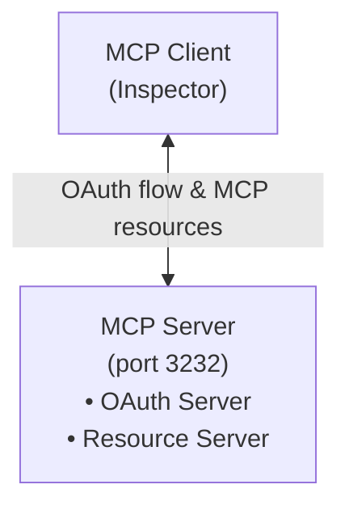
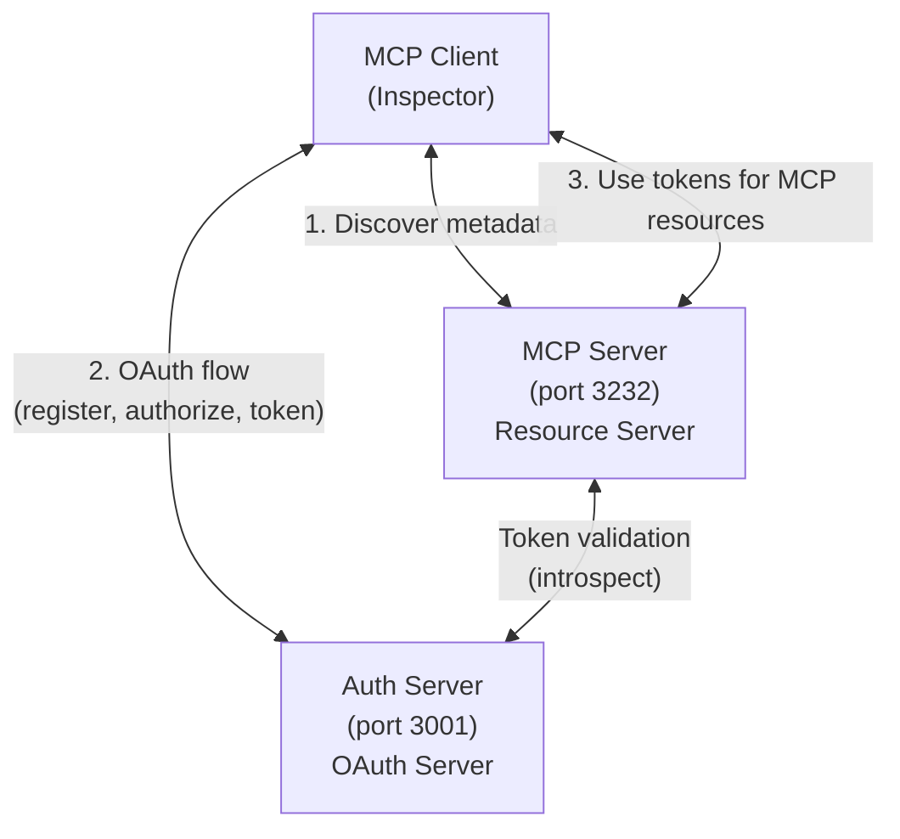

# MCP Everything Server

_Note: these docs were AI generated based on a claude code transcript, and then edited manually for accuracy_

A comprehensive example implementation of a scalable Model Context Protocol (MCP) server that demonstrates all MCP functionality with full authentication support and horizontal scalability.

## Overview

The Everything Server is an open-source reference implementation that showcases:
- **Complete [MCP Protocol](https://modelcontextprotocol.io/specification) Support**: All MCP features including tools, resources, prompts, sampling, completions, and logging
- **Multiple [Transport Methods](https://modelcontextprotocol.io/docs/concepts/transports)**: Streamable HTTP (SHTTP) and Server-Sent Events (SSE)
- **Comprehensive Auth**: OAuth 2.0 with fake upstream provider for testing
- **Horizontal Scalability**: Redis-backed session management for multi-instance deployments

This server serves as both primarily as a learning resource, and an example implementation of a scalable remote MCP server.

## Features

### MCP Protocol Features
- **[Tools](https://modelcontextprotocol.io/docs/concepts/tools)**: 7 demonstration tools including echo, add, long-running operations, LLM sampling, image handling, annotations, and resource references
- **[Resources](https://modelcontextprotocol.io/docs/concepts/resources)**: 100 example resources with pagination, templates, and subscription support
- **[Prompts](https://modelcontextprotocol.io/docs/concepts/prompts)**: Simple and complex prompts with argument support and resource embedding
- **[Sampling](https://modelcontextprotocol.io/docs/concepts/sampling)**: Integration with MCP sampling for LLM interactions
- **Completions**: Auto-completion support for prompt arguments
- **Logging**: Multi-level logging with configurable verbosity
- **Notifications**: Progress updates, resource updates, and stderr messages

### Transport & Infrastructure
- **[Streamable HTTP](https://modelcontextprotocol.io/specification/2025-03-26/basic/transports#streamable-http)**: Full implementation with GET/POST/DELETE support
- **[SSE Transport](https://modelcontextprotocol.io/specification/2025-03-26/basic/transports#server-sent-events)**: Backwards-compatible Server-Sent Events
- **Redis Integration**: Pub/sub message routing and session state management
- **Session Management**: 5-minute TTL with automatic cleanup
- **Horizontal Scaling**: Any instance can handle any request

### Authentication & Security
- **Dual Mode Support**: Run with integrated or separate authorization server
- **[OAuth 2.0](https://modelcontextprotocol.io/specification/2025-03-26/basic/authorization)**: Complete authorization flow with PKCE support
- **External Auth Ready**: Demonstrates integration with external OAuth providers
- **Session Ownership**: User isolation and access control  
- **Security Headers**: CSP, HSTS, X-Frame-Options, and more
- **Bearer Token Auth**: Middleware for protected endpoints

## Authentication Modes

The Everything Server supports two authentication modes to demonstrate different MCP deployment patterns:

### Integrated Mode (Default)
The MCP server acts as its own OAuth 2.0 authorization server. This is simpler to deploy and suitable for standalone MCP servers.

```bash
npm run dev:integrated
```

### Separate Mode
The MCP server delegates authentication to a standalone authorization server. This demonstrates how MCP servers can integrate with existing OAuth infrastructure. See [auth-server/README.md](auth-server/README.md) for more details about the standalone auth server.

```bash
# Start both the auth server and MCP server
npm run dev:with-separate-auth

# Or run them separately:
# Terminal 1: Start the authorization server
npm run dev:auth-server

# Terminal 2: Start the MCP server in separate mode
npm run dev:separate
```

In production, the separate authorization server would typically be replaced with:
- Corporate SSO (Auth0, Okta)
- Cloud providers (AWS Cognito, Azure AD)
- Social providers (Google, GitHub)

### Testing with MCP Inspector

The MCP Inspector is a web-based tool for testing MCP servers. You can run it locally:
```bash
npx -y @modelcontextprotocol/inspector
```

#### Integrated Mode
```bash
# 1. Start Redis
docker compose up -d

# 2. Start the server
npm run dev:integrated

# 3. Open MCP Inspector
npx -y @modelcontextprotocol/inspector

# 4. Connect and test:
#    - Connect to http://localhost:3232/mcp
#    - Navigate to the Auth tab
#    - Complete the OAuth flow
#    - All auth endpoints will be served from :3232
```

#### Separate Mode
```bash
# 1. Start Redis
docker compose up -d

# 2. Start both servers
npm run dev:with-separate-auth

# 3. Open MCP Inspector
npx -y @modelcontextprotocol/inspector

# 4. Connect and test:
#    - Connect to http://localhost:3232/mcp
#    - Navigate to the Auth tab
#    - The auth flow will redirect to :3001 for authentication
#    - After auth, tokens from :3001 will be used on :3232
```

### Architecture Diagrams

#### Integrated Mode


#### Separate Mode


## OAuth Flow Analysis

### OAuth 2.0 + PKCE Flow Sequence

The server implements a complete OAuth 2.0 authorization code flow with PKCE. Here's how each step maps to data storage and expiry:

**1. Client Registration** (app setup - happens once)
```
App → Auth Server: "I want to use OAuth, here's my info"
Auth Server → App: "OK, your client_id is XYZ, client_secret is ABC"
```
- **Storage**: Client credentials for future OAuth flows
- **Expiry**: 30 days (long-lived app credentials)

**2. Authorization Request** (starts each OAuth flow)
```
User → App: "I want to connect to MCP server"
App → Auth Server: "User wants access, here's my PKCE challenge"
Auth Server: Stores pending authorization, shows auth page
```
- **Storage**: `PENDING_AUTHORIZATION` - temporary state during flow
- **Expiry**: 10 minutes (short-lived temporary state)

**3. Authorization Code Exchange** (completes OAuth flow)
```
User → Auth Server: "I approve this app"
Auth Server → App: "Here's your authorization code"
App → Auth Server: "Exchange code + PKCE verifier for tokens"
Auth Server → App: "Here are your access/refresh tokens"
```
- **Storage**: `TOKEN_EXCHANGE` - prevents replay attacks
- **Expiry**: 10 minutes (single-use, consumed immediately)

**4. Token Storage** (long-term user session)
```
Auth Server: Issues access_token + refresh_token
Server: Stores user installation with tokens
```
- **Storage**: `UPSTREAM_INSTALLATION` - the actual user session
- **Expiry**: 7 days (balances security vs usability)

**5. Token Refresh** (extends user session)
```
App → Auth Server: "My access token expired, here's my refresh token"
Auth Server → App: "Here's a new access token"
```
- **Storage**: `REFRESH_TOKEN` - mapping for token rotation
- **Expiry**: 7 days (matches installation lifetime)

### Data Lifecycle Hierarchy

**Timeline (shortest to longest expiry):**
1. **OAuth flow state** (10 minutes) - very temporary
2. **User sessions** (7 days) - medium-term
3. **Client credentials** (30 days) - long-term

This creates a logical hierarchy where each layer outlives the layers it supports.

## Installation

### Prerequisites
- Node.js >= 16
- Redis server (see Redis setup below)
- npm or yarn

### Redis Setup
The server requires Redis for session management and message routing.

**Option 1: Docker Compose (Recommended)**

Install a Docker runtime:
- **macOS**: [OrbStack](https://orbstack.dev/) - Fast, lightweight, and free
  ```bash
  brew install orbstack
  # Or download from https://orbstack.dev/download
  ```
- **Windows/Linux**: [Docker Desktop](https://www.docker.com/products/docker-desktop)

Start Redis:
```bash
# see docker-compose.yml
docker compose up -d
```

**Option 2: Local Installation**
```bash
# macOS
brew install redis && brew services start redis

# Ubuntu/Debian  
sudo apt-get install redis-server && sudo systemctl start redis
```

### Setup
```bash
# Clone the repository
git clone https://github.com/modelcontextprotocol/example-remote-server.git
cd example-remote-server

# Install dependencies
npm install

# Configure environment (optional)
cp .env.example .env
# Edit .env with your settings
```

### Configuration
Environment variables (`.env` file):
```bash
# Server Configuration
PORT=3232                          # MCP server port
BASE_URI=http://localhost:3232     # Base URI for OAuth redirects

# Redis Configuration  
REDIS_URL=redis://localhost:6379   # Redis connection URL

# Authentication Mode (integrated | separate)
AUTH_MODE=integrated               # Default: integrated mode

# Separate Mode Configuration (only used when AUTH_MODE=separate)
AUTH_SERVER_URL=http://localhost:3001  # External auth server URL
AUTH_SERVER_PORT=3001              # Auth server port (for standalone server)
```

**Pre-configured environment files:**
- `.env.integrated` - Configuration for integrated mode
- `.env.separate` - Configuration for separate mode

```bash
# Use integrated mode
cp .env.integrated .env

# Use separate mode  
cp .env.separate .env
```

## Development

### Commands

#### Development
```bash
# Start development server with hot reload
npm run dev

# Start in integrated mode (MCP server as OAuth server)
npm run dev:integrated

# Start in separate mode (external auth server)
npm run dev:separate

# Start standalone authorization server
npm run dev:auth-server

# Start both auth server and MCP server in separate mode
npm run dev:with-separate-auth

# Start development server with debugging
npm run dev:break
```

#### Build & Production
```bash
# Build TypeScript to JavaScript
npm run build

# Build authorization server
npm run build:auth-server

# Build everything
npm run build:all

# Run production server
npm start

# Run production auth server
npm run start:auth-server
```

#### Testing & Quality
```bash
# Run linting
npm run lint

# Run tests
npm test
```

### Project Structure
```
├── src/
│   ├── index.ts              # Express app setup and routes
│   ├── config.ts             # Configuration management
│   ├── redis.ts              # Redis client setup
│   ├── auth/
│   │   └── provider.ts       # OAuth auth provider implementation
│   ├── handlers/
│   │   ├── shttp.ts          # Streamable HTTP handler
│   │   ├── sse.ts            # SSE transport handler
│   │   ├── fakeauth.ts       # Fake upstream auth handler
│   │   └── common.ts         # Shared middleware
│   ├── services/
│   │   ├── mcp.ts            # MCP server implementation
│   │   ├── auth.ts           # Session ownership management
│   │   └── redisTransport.ts # Redis-backed transport
│   └── utils/
│       └── logger.ts         # Structured logging
├── docs/
│   ├── streamable-http-design.md  # SHTTP implementation details
│   └── user-id-system.md          # Authentication flow documentation
├── scratch/                        # Development scripts and tests
└── dist/                          # Compiled JavaScript output
```

## API Endpoints

### MCP Endpoints
- `GET/POST/DELETE /mcp` - Streamable HTTP transport endpoint
  - `POST`: Initialize sessions or send messages
  - `GET`: Establish SSE streams
  - `DELETE`: Terminate sessions
- `GET /sse` - Legacy SSE transport endpoint
- `POST /message` - Legacy message endpoint for SSE transport

### Authentication Endpoints
- `GET /fakeupstreamauth/authorize` - Fake OAuth authorization page
- `GET /fakeupstreamauth/redirect` - OAuth redirect handler
- OAuth 2.0 endpoints provided by MCP SDK auth router

### Headers
- `Mcp-Session-Id`: Session identifier for Streamable HTTP
- `Authorization: Bearer <token>`: OAuth access token
- Standard MCP headers as per protocol specification

## Authentication Flow

The server implements a complete [OAuth 2.0](https://modelcontextprotocol.io/specification/2025-03-26/basic/authorization) flow with a fake upstream provider for testing:

1. **Client Registration**: Clients register to obtain client_id and client_secret
2. **Authorization**: Users authenticate through `/fakeupstreamauth/authorize`
3. **User Management**: localStorage-based user ID system for testing
4. **Token Exchange**: Authorization codes exchanged for access tokens
5. **Session Creation**: Authenticated tokens create owned sessions
6. **Access Control**: Sessions are isolated by user ownership

See [docs/user-id-system.md](docs/user-id-system.md) for detailed authentication documentation.

## Transport Methods

### Streamable HTTP (Recommended)
Modern [transport](https://modelcontextprotocol.io/specification/2025-03-26/basic/transports#streamable-http) supporting bidirectional communication over HTTP:
- Single endpoint for all operations
- Session management via headers
- Efficient message buffering
- Automatic reconnection support

See [docs/streamable-http-design.md](docs/streamable-http-design.md) for implementation details.

### Server-Sent Events (Legacy)
Backwards-compatible [transport](https://modelcontextprotocol.io/specification/2025-03-26/basic/transports#server-sent-events) using SSE:
- Separate endpoints for SSE streams and messages
- Session management via URL parameters
- Redis-backed message routing
- Real-time event delivery

## Scalability Architecture

The server is designed for horizontal scaling using Redis as the backbone:

### Session State Management
- **Redis Storage**: All session state stored in Redis
- **5-minute TTL**: Automatic session cleanup
- **Session Ownership**: User isolation via Redis keys
- **Stateless Servers**: Any instance can handle any request

### Message Routing
- **Pub/Sub Channels**: Redis channels for message distribution
- **Message Buffering**: Reliable delivery for disconnected clients
- **Connection State**: Tracked via pub/sub subscription counts
- **Automatic Cleanup**: No explicit cleanup required

### Redis Key Structure
```
session:{sessionId}:owner                    # Session ownership
mcp:shttp:toserver:{sessionId}              # Client→Server messages
mcp:shttp:toclient:{sessionId}:{requestId}  # Server→Client responses
mcp:control:{sessionId}                     # Control messages
```

## Testing

### Running Tests
```bash
# Run all tests
npm test

# Run specific test suites
npm test -- --testNamePattern="User Session Isolation"
npm test -- --testNamePattern="session ownership"

# Run with coverage
npm test -- --coverage
```

### Test Categories
- **Unit Tests**: Individual component testing
- **Integration Tests**: Transport and Redis integration
- **Auth Tests**: OAuth flow and session ownership
- **Multi-user Tests**: User isolation and access control

### Manual Testing
The `scratch/` directory contains utility scripts for testing:
- `oauth.sh` - Test OAuth flows
- `simple-test-client.js` - Basic client implementation
- `test-shttp-client.ts` - Streamable HTTP testing
- `debug-mcp-flow.sh` - Debug MCP message flows

## Security

### Implemented Security Measures
- **Authentication**: [OAuth 2.0](https://modelcontextprotocol.io/specification/2025-03-26/basic/authorization) with bearer tokens
- **Authorization**: User-based session ownership
- **Session Isolation**: Users can only access their own sessions
- **Security Headers**: 
  - Content Security Policy (CSP)
  - Strict Transport Security (HSTS)
  - X-Frame-Options
  - X-Content-Type-Options
- **Input Validation**: Zod schemas for all inputs
- **Error Handling**: Sanitized error responses

### Security Best Practices
1. Always use HTTPS in production
2. Configure proper CORS origins
3. Use strong client secrets
4. Enable all security headers
5. Monitor session lifetimes
6. Implement rate limiting
7. Use structured logging

## Monitoring & Debugging

### Logging
Structured JSON logging with sanitized outputs:
- HTTP request/response logging
- Authentication events
- Session lifecycle events
- Redis operations
- Error tracking

### Redis Monitoring
```bash
# Monitor session ownership
redis-cli KEYS "session:*:owner"

# Watch real-time operations
redis-cli MONITOR | grep "session:"

# Check active sessions
redis-cli PUBSUB CHANNELS "mcp:shttp:toserver:*"

# Debug specific session
redis-cli GET "session:{sessionId}:owner"
```

### Debug Tools
- Development scripts in `scratch/` directory
- Comprehensive test suite
- Hot-reload development mode
- Source maps for debugging

## Contributing

We welcome contributions! Please see our [Contributing Guidelines](CONTRIBUTING.md) for details.

### Development Workflow
1. Fork the repository
2. Create a feature branch
3. Implement your changes
4. Add tests for new functionality
5. Ensure all tests pass
6. Run linting and fix issues
7. Submit a pull request

### Code Style
- TypeScript with strict mode
- ESLint configuration included
- Prettier formatting recommended
- Comprehensive type definitions

## License

This project is licensed under the MIT License - see the [LICENSE](LICENSE) file for details.

## Acknowledgments

Built by the Model Context Protocol team as a reference implementation for the MCP ecosystem.

## Links

- [Model Context Protocol Documentation](https://modelcontextprotocol.io)
- [MCP Specification](https://modelcontextprotocol.io/specification)
- [MCP Concepts](https://modelcontextprotocol.io/docs/concepts)
  - [Tools](https://modelcontextprotocol.io/docs/concepts/tools)
  - [Resources](https://modelcontextprotocol.io/docs/concepts/resources)
  - [Prompts](https://modelcontextprotocol.io/docs/concepts/prompts)
  - [Sampling](https://modelcontextprotocol.io/docs/concepts/sampling)
  - [Transports](https://modelcontextprotocol.io/docs/concepts/transports)
- [TypeScript SDK](https://github.com/modelcontextprotocol/typescript-sdk)
- [Example Servers](https://github.com/modelcontextprotocol/servers)