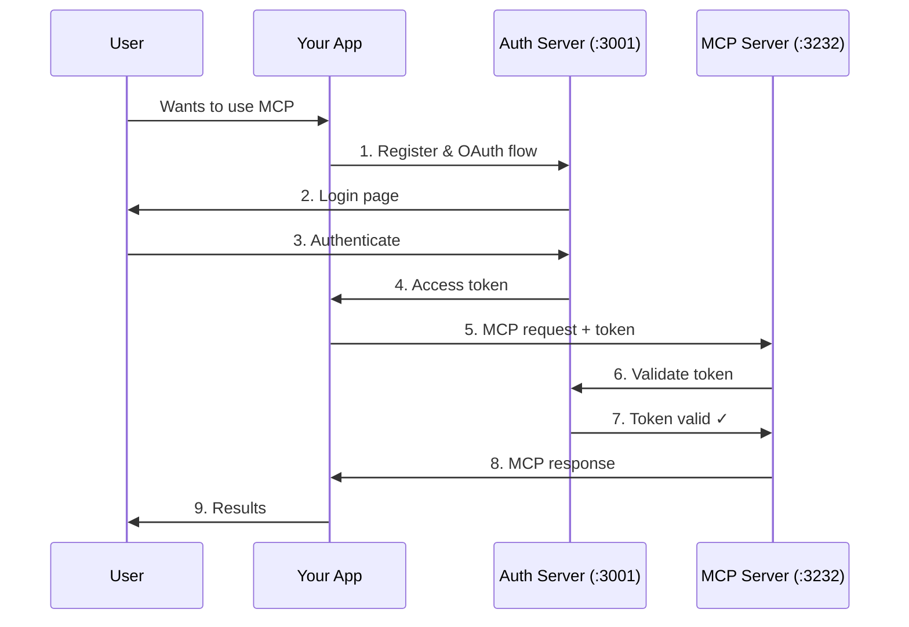

# MCP Feature Reference Server

A production-ready example of a Model Context Protocol (MCP) server with OAuth 2.0 authentication, demonstrating best practices for secure, scalable MCP deployments.

## What is this?

This repository provides a complete implementation of an MCP server that:
- Shows how to add authentication to MCP servers using OAuth 2.0
- Demonstrates all MCP protocol features (tools, resources, prompts)
- Uses a scalable architecture suitable for production deployments
- Serves as a learning resource and starting template for your own MCP servers

The [Model Context Protocol](https://modelcontextprotocol.io) is an open standard that enables seamless integration between AI applications and external data sources, tools, and services.

## Table of Contents

- [Getting Started](#getting-started)
  - [Quick Start](#quick-start)
  - [Installation](#installation)
  - [Testing](#testing)
  - [Common Issues & Solutions](#common-issues--solutions)
- [Understanding the System](#understanding-the-system)
  - [Features](#features)
  - [Repository Structure](#repository-structure)
  - [Authentication & Authorization](#authentication--authorization)
  - [Configuration](#configuration)
  - [Customizing for Your Use Case](#customizing-for-your-use-case)
- [Development & Operations](#development--operations)
  - [Development](#development)
  - [Monitoring & Debugging](#monitoring--debugging)
- [Reference](#reference)
  - [API Reference](#api-reference)
  - [Technical Details](#technical-details)
  - [Security](#security)
  - [External Resources](#external-resources)
- [Contributing](#contributing)
  - [License](#license)

---

# Getting Started

## Quick Start

*For detailed installation instructions, see [Installation](#installation) below.*

Get the server running in 5 minutes:

```bash
# 1. Prerequisites
brew install orbstack       # macOS: Install OrbStack (skip if already installed)
orbctl start                # macOS: Start OrbStack daemon
# OR install Docker Desktop and start it (Windows/Linux/macOS alternative)

# 2. Setup
git clone https://github.com/modelcontextprotocol/example-remote-server.git
cd example-remote-server
npm install                 # Install dependencies for all workspaces

# 3. Start services
docker compose up -d        # Start Redis
npm run dev                 # Start both auth-server and mcp-server

# 4. Test with Inspector
npx -y @modelcontextprotocol/inspector

# Connect to http://localhost:3232/mcp
# (Make sure to include the http:// prefix!)
```

## Installation

### Prerequisites
- Node.js >= 16
- npm or yarn
- Docker runtime (for Redis)

### Step 1: Install Docker Runtime
Choose one option:

**macOS (Recommended: OrbStack)**
```bash
brew install orbstack
# Start OrbStack daemon (required before using Docker commands)
orbctl start
# Or download from https://orbstack.dev/download
```

**Windows/Linux: Docker Desktop**
- Download from https://www.docker.com/products/docker-desktop
- Start Docker Desktop after installation

**Alternative: Local Redis Installation**
```bash
# macOS
brew install redis && brew services start redis

# Ubuntu/Debian
sudo apt-get install redis-server && sudo systemctl start redis
```

### Step 2: Clone and Install Dependencies
```bash
git clone https://github.com/modelcontextprotocol/example-remote-server.git
cd example-remote-server
npm install  # Installs dependencies for all workspaces
```

### Step 3: Start Redis
```bash
# Ensure Docker/OrbStack is running first!
docker compose up -d

# Verify Redis is running
docker compose ps
```

### Step 4: Start the Servers
```bash
# Start both servers concurrently
npm run dev

# Or start them individually:
npm run dev:auth-server  # Auth server on http://localhost:3001
npm run dev:mcp-server   # MCP server on http://localhost:3232
```

## Testing

### With MCP Inspector (Recommended)

The easiest way to test the server:

```bash
# 1. Ensure servers are running (npm run dev)

# 2. Launch Inspector
npx -y @modelcontextprotocol/inspector

# 3. Connect to http://localhost:3232/mcp
# 4. Complete OAuth flow in the Auth tab
# 5. Test tools, resources, and prompts interactively
```

### With Example Scripts

The `examples/` directory contains runnable code demonstrating OAuth and MCP interactions:

- **`client.js`**: Complete Node.js example with OAuth flow and MCP operations
- **`curl-examples.sh`**: Shell script showing raw HTTP/curl usage

See [examples/README.md](examples/README.md) for detailed usage.

## Common Issues & Solutions

### "Token validation failed"
- **Cause**: Token expired or servers not communicating
- **Solution**:
  - Ensure both servers are running (`npm run dev`)
  - Check that Redis is running (`docker compose ps`)
  - Verify the token hasn't expired (tokens last 7 days)

### "Cannot connect to MCP server" or "Connection Error - Check if your MCP server is running"
- **Cause**: Incorrect URL format or servers not running
- **Solution**:
  - Use the full URL with http:// prefix: `http://localhost:3232/mcp`
  - Ensure **both** auth and MCP servers are running (`npm run dev`)

### "Wrong endpoint for SSE transport" or SSE connection fails to `/mcp`
- **Cause**: Using SSE transport with Streamable HTTP endpoint
- **Solution**:
  - For **SSE transport** (legacy): Use `http://localhost:3232/sse`
  - For **Streamable HTTP** (recommended): Use `http://localhost:3232/mcp`
  - In MCP Inspector: Match transport type with the correct endpoint

### "Cannot connect to Docker daemon"
- **Cause**: Docker/OrbStack not running
- **Solution**:
  - macOS with OrbStack: `orbctl start` (verify with `orbctl status`)
  - Windows/Linux/macOS with Docker Desktop: Start Docker Desktop application

### "Redis connection refused"
- **Cause**: Redis container not running
- **Solution**:
  - Check Redis is running: `docker compose ps`
  - If not running: `docker compose up -d`
  - Ensure Docker/OrbStack is started first

### "Port already in use"
- **Cause**: Another process using port 3001 or 3232
- **Solution**:
  - Check for existing processes: `lsof -i :3232` or `lsof -i :3001`
  - Kill existing processes or change PORT in .env files

### "Authentication service unavailable" (HTTP 503)
- **Cause**: Auth server is not running or not reachable
- **What happens**: MCP server runs in degraded mode
  - Splash page accessible with warning banner
  - Health endpoint shows degraded status: `curl http://localhost:3232/health`
  - Protected MCP endpoints return 503 with helpful error message
- **Solution**:
  - Start the auth server: `npm run dev` (starts both servers)
  - Or start manually: `cd auth-server && npm run dev`
  - Restart the MCP server to retry connection

### "Authentication flow fails"
- **Cause**: Misconfiguration or servers not communicating
- **Solution**:
  - Check server logs for error messages
  - Ensure Redis is running: `docker compose ps`
  - Verify .env configuration in both server directories
  - Check that both servers are running

---

# Understanding the System

## Features

### MCP Protocol Features
- **[Tools](https://modelcontextprotocol.io/docs/concepts/tools)**: 7 demonstration tools including echo, add, long-running operations, LLM sampling, image handling, annotations, and resource references
- **[Resources](https://modelcontextprotocol.io/docs/concepts/resources)**: 100 example resources with pagination, templates, and subscription support
- **[Prompts](https://modelcontextprotocol.io/docs/concepts/prompts)**: Simple and complex prompts with argument support and resource embedding
- **[Sampling](https://modelcontextprotocol.io/docs/concepts/sampling)**: Integration with MCP sampling for LLM interactions
- **Completions**: Auto-completion support for prompt arguments
- **Logging**: Multi-level logging with configurable verbosity
- **Notifications**: Progress updates, resource updates, and stderr messages

### Transport & Infrastructure
- **[Streamable HTTP](https://modelcontextprotocol.io/specification/2025-03-26/basic/transports#streamable-http)**: Full implementation with GET/POST/DELETE support
- **[SSE Transport](https://modelcontextprotocol.io/specification/2025-03-26/basic/transports#server-sent-events)**: Backwards-compatible Server-Sent Events
- **Redis Integration**: Pub/sub message routing and session state management
- **Session Management**: 5-minute TTL with automatic cleanup
- **Horizontal Scaling**: Any instance can handle any request

### Authentication & Security
- **[OAuth 2.0](https://modelcontextprotocol.io/specification/2025-03-26/basic/authorization)**: Complete authorization flow with PKCE support
- **Separate Auth Server**: Demonstrates integration with external OAuth providers
- **Token Introspection**: Validates tokens via [RFC 7662](https://datatracker.ietf.org/doc/html/rfc7662)
- **Session Ownership**: User isolation and access control
- **Security Headers**: CSP, HSTS, X-Frame-Options, and more
- **Bearer Token Auth**: Middleware for protected endpoints

## Repository Structure

This repository demonstrates a production-ready MCP deployment pattern with separate authorization and resource servers:

```
auth-server/             # OAuth 2.0 authorization server (demo only - replace in production)
  └── src/               # Authorization endpoints and token management

mcp-server/              # MCP resource server (customize tools/resources/prompts)
  └── src/               # MCP protocol implementation with external auth

scripts/                 # Testing and deployment scripts
docs/                    # Architecture and API documentation
examples/                # Example code and usage patterns
```

The architecture separates authentication concerns from MCP functionality, allowing you to integrate with commercial OAuth providers (Auth0, Okta, etc.).

## Authentication & Authorization

Per the [MCP Authorization specification](https://modelcontextprotocol.io/specification/2025-06-18/basic/authorization), this implementation demonstrates a production-ready pattern with separate authorization and resource servers.

### Why OAuth for MCP?

MCP servers often handle sensitive operations and data. This implementation shows how to:
- Authenticate users before granting access to MCP resources
- Integrate with existing identity providers (Auth0, Okta, Google)
- Implement user session isolation in multi-tenant environments
- Scale horizontally while maintaining security

### Authentication Flow



This architecture pattern:
- **Separates concerns**: Auth server handles OAuth, MCP server handles protocol
- **Enables integration**: Can replace auth server with Auth0, Okta, etc.
- **Scales independently**: Auth and MCP servers can scale based on their load
- **Follows standards**: Uses OAuth 2.0 and token introspection (RFC 7662)

### Mock Identity Provider

The `/mock-upstream-idp` endpoints simulate what a real identity provider (Google, GitHub, corporate SSO) would do. In production, users would be redirected to their actual identity provider for login. This mock implementation helps you test the complete flow locally without external dependencies.

For detailed OAuth flow analysis including data storage and TTLs, see [docs/oauth-flow.md](docs/oauth-flow.md).
For alternative patterns like embedded OAuth, see [docs/oauth-architecture-patterns.md](docs/oauth-architecture-patterns.md).

## Configuration

Each server has its own `.env` file:

**Auth Server** (`auth-server/.env`):
```bash
AUTH_SERVER_URL=http://localhost:3001  # Auth server URL
AUTH_SERVER_PORT=3001                  # Auth server port
BASE_URI=http://localhost:3232         # MCP server URL (for redirects)
REDIS_URL=redis://localhost:6379       # Redis connection
```

**MCP Server** (`mcp-server/.env`):
```bash
BASE_URI=http://localhost:3232         # MCP server URL
PORT=3232                              # MCP server port
AUTH_SERVER_URL=http://localhost:3001  # External auth server URL
REDIS_URL=redis://localhost:6379       # Redis connection
```

## Customizing for Your Use Case

This is a reference implementation with demo tools, resources, and prompts. To adapt it for production:
- **Replace MCP features:** See [Customization Guide](docs/customization-guide.md) for replacing demo functionality with your own
- **Integrate OAuth provider:** See [OAuth Architecture Patterns](docs/oauth-architecture-patterns.md) for production authentication setup

---

# Development & Operations

## Development

```bash
# Start servers
npm run dev                 # Both servers concurrently
npm run dev:auth-server     # Auth server only
npm run dev:mcp-server      # MCP server only
```

### Build & Production
```bash
npm run build               # Build all workspaces
npm run start               # Run both servers
npm run start:auth-server   # Run auth server only
npm run start:mcp-server    # Run MCP server only
```

### Testing & Quality
```bash
npm test                    # All unit tests
npm run lint                # Lint all code
npm run typecheck           # Typecheck all code
npm run test:e2e            # End-to-end test
```

### Automated End-to-End Testing

The E2E script in `scripts/test-e2e.sh` verifies the complete OAuth flow and all MCP features:

```bash
npm run test:e2e
```

The script:
- Automatically manages server lifecycle
- Tests OAuth 2.0 + PKCE flow
- Verifies all MCP features (tools, resources, prompts)
- Validates token introspection between servers
- Tests session management and ownership

## Monitoring & Debugging

### Logging
Structured JSON logging with sanitized outputs:
- HTTP request/response logging
- Authentication events
- Session lifecycle events
- Redis operations
- Error tracking

### Redis Monitoring
```bash
# Monitor session ownership
redis-cli KEYS "session:*:owner"

# Watch real-time operations
redis-cli MONITOR | grep "session:"

# Check active sessions
redis-cli PUBSUB CHANNELS "mcp:shttp:toserver:*"

# Debug specific session
redis-cli GET "session:{sessionId}:owner"
```

### Debug Tools
- MCP Inspector for interactive debugging
- Comprehensive test suite
- Hot-reload development mode
- Source maps for debugging
- Redis monitoring commands

---

# Reference

## API Reference

For a complete listing of all endpoints provided by each server, including OAuth authorization endpoints, MCP resource endpoints, and demo identity provider endpoints, see [docs/endpoints.md](docs/endpoints.md).

## Technical Details

### Scalability Architecture

The server is designed for horizontal scaling using Redis as the backbone:

#### Session State Management
- **Redis Storage**: All session state stored in Redis
- **5-minute TTL**: Automatic session cleanup
- **Session Ownership**: User isolation via Redis keys
- **Stateless Servers**: Any instance can handle any request

#### Message Routing
- **Pub/Sub Channels**: Redis channels for message distribution
- **Message Buffering**: Reliable delivery for disconnected clients
- **Connection State**: Tracked via pub/sub subscription counts
- **Automatic Cleanup**: No explicit cleanup required

#### Redis Key Structure

##### MCP Session Keys
```
session:{sessionId}:owner                    # Session ownership
mcp:shttp:toserver:{sessionId}              # Client→Server messages
mcp:shttp:toclient:{sessionId}:{requestId}  # Server→Client responses
mcp:control:{sessionId}                     # Control messages
```

##### OAuth/Auth Keys
```
auth:client:{clientId}                      # OAuth client registrations
auth:pending:{authCode}                     # Pending authorizations
auth:installation:{accessToken}             # Active MCP installations
auth:exch:{authCode}                        # Token exchanges
auth:refresh:{refreshToken}                 # Refresh tokens
```

Note: The `auth:` prefix ensures complete namespace isolation between auth and MCP functions.

### Transport Methods

#### Streamable HTTP (Recommended)
Modern [transport](https://modelcontextprotocol.io/specification/2025-03-26/basic/transports#streamable-http) supporting bidirectional communication over HTTP:
- Single endpoint for all operations
- Session management via headers
- Efficient message buffering
- Automatic reconnection support

#### Server-Sent Events (Legacy)
Backwards-compatible [transport](https://modelcontextprotocol.io/specification/2025-03-26/basic/transports#server-sent-events) using SSE:
- Separate endpoints for SSE streams and messages
- Session management via URL parameters
- Redis-backed message routing
- Real-time event delivery

## Security

### Implemented Security Measures
- **Authentication**: [OAuth 2.0](https://modelcontextprotocol.io/specification/2025-03-26/basic/authorization) with bearer tokens
- **Token Validation**: Introspection via [RFC 7662](https://datatracker.ietf.org/doc/html/rfc7662)
- **Authorization**: User-based session ownership
- **Session Isolation**: Users can only access their own sessions
- **Security Headers**:
  - Content Security Policy (CSP)
  - Strict Transport Security (HSTS)
  - X-Frame-Options
  - X-Content-Type-Options
- **Input Validation**: Zod schemas for all inputs
- **Error Handling**: Sanitized error responses

### Security Best Practices
1. Always use HTTPS in production
2. Configure proper CORS origins
3. Use strong client secrets
4. Enable all security headers
5. Monitor session lifetimes
6. Implement rate limiting
7. Use structured logging

## External Resources

### MCP Documentation
- [Model Context Protocol Documentation](https://modelcontextprotocol.io)
- [MCP Authorization Specification](https://modelcontextprotocol.io/specification/2025-06-18/basic/authorization)
- [MCP Specification](https://modelcontextprotocol.io/specification)
- [MCP Concepts](https://modelcontextprotocol.io/docs/concepts)
  - [Tools](https://modelcontextprotocol.io/docs/concepts/tools)
  - [Resources](https://modelcontextprotocol.io/docs/concepts/resources)
  - [Prompts](https://modelcontextprotocol.io/docs/concepts/prompts)
  - [Sampling](https://modelcontextprotocol.io/docs/concepts/sampling)
  - [Transports](https://modelcontextprotocol.io/docs/concepts/transports)
- [TypeScript SDK](https://github.com/modelcontextprotocol/typescript-sdk)

### OAuth 2.0 / 2.1 Resources
- [RFC 6749: OAuth 2.0 Framework](https://datatracker.ietf.org/doc/html/rfc6749)
- [RFC 7662: Token Introspection](https://datatracker.ietf.org/doc/html/rfc7662)
- [OAuth 2.1 Draft](https://oauth.net/2.1/) - Modern security best practices
- [OAuth.net: End User Authentication](https://oauth.net/articles/authentication/)
- [The Resource Server - OAuth 2.0 Simplified](https://www.oauth.com/oauth2-servers/the-resource-server/)

---

# Contributing

We welcome contributions!

### Development Workflow
1. Fork the repository
2. Create a feature branch
3. Implement your changes
4. Add tests for new functionality
5. Ensure all tests pass
6. Run linting and fix issues
7. Submit a pull request

### Code Style
- TypeScript with strict mode
- ESLint configuration included
- Comprehensive type definitions

## License

This project is licensed under the MIT License - see the [LICENSE](LICENSE) file for details.