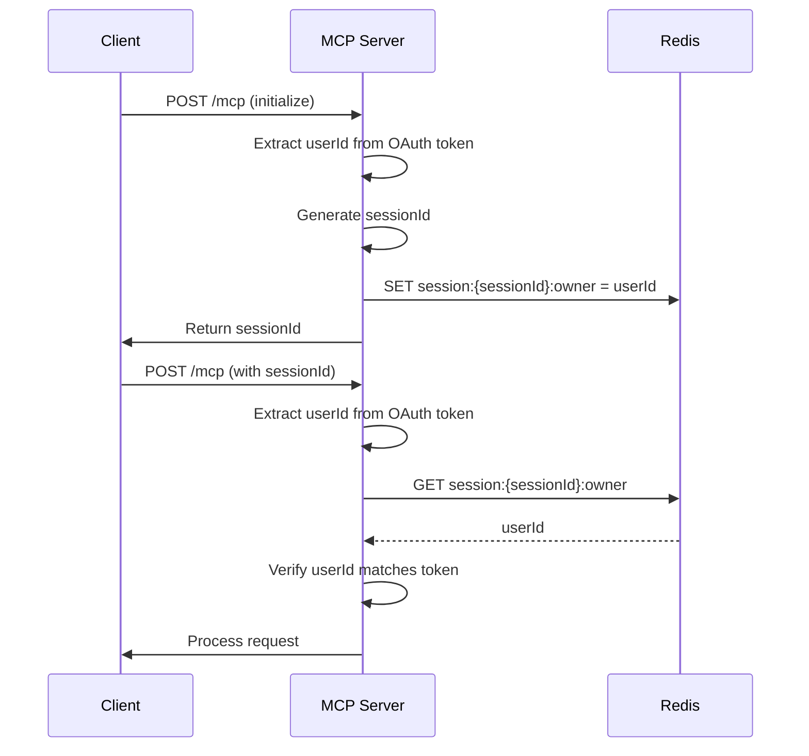

# Session Ownership System

## Overview

The MCP server implements multi-user session isolation to ensure users can only access their own MCP sessions. This is accomplished using user identifiers and Redis-backed ownership tracking.

## How It Works

Each MCP session is owned by a specific user. Session ownership is stored in Redis and validated on each request.

### User ID Assignment

**Production**: OAuth providers assign unique user identifiers via the `sub` (subject) claim - a standard OAuth/OpenID Connect field.

User ID sources:
- **Provider's user database**: Users created in Auth0/Okta (example: `auth0|507f1f77bcf86cd799439011`)
- **Social/federated identities**: Provider links to Google, Facebook (example: `google-oauth2|112233445566778899`)
- **Enterprise connections**: SAML, LDAP, Active Directory (example: `samlp|ad|john.doe@company.com`)

**This implementation**: Mock upstream IDP returns HTML with JavaScript that generates a random UUID in the browser, stores it in `localStorage.mcpUserId`, and sends it to the server as a query parameter. This simulates user authentication for testing - different browsers/tabs get different UUIDs, allowing multi-user testing.

### Token Validation

When the MCP server validates an access token:

1. MCP server calls the auth server's `/introspect` endpoint with the token
2. Auth server validates the token and returns user information including the `sub` field (user ID)
3. MCP server populates `AuthInfo.extra.userId` with this user identifier

This separation allows the auth server to be replaced with any OAuth provider that supports token introspection.

### Session Creation

```typescript
const userId = req.auth?.extra?.userId;
const sessionId = randomUUID();
await redisClient.set(`session:${sessionId}:owner`, userId);
```

### Session Access Validation

```typescript
const owner = await redisClient.get(`session:${sessionId}:owner`);
if (owner !== userId) {
  throw new Error('Session not owned by user');
}
```

## Redis Key Structure

### Session Ownership
```
session:{sessionId}:owner → userId
```

Example: `session:550e8400-...:owner` → `auth0|507f1f77bcf86cd799439011`

### Session Liveness

Sessions are considered "live" when an MCP server process is actively handling them. This is tracked via Redis pub/sub subscription counts:

```
mcp:shttp:toserver:{sessionId} → pub/sub channel
```

Check if live: `PUBSUB NUMSUB mcp:shttp:toserver:{sessionId}` returns > 0

When an MCP server starts handling a session, it subscribes to the channel. When it shuts down (gracefully or via crash), Redis automatically removes the subscription.

## Security

- **Session isolation**: Users can only access sessions they own
- **Ownership persistence**: Survives across requests and server restarts
- **Token-based validation**: User ID extracted from validated OAuth token
- **Access control**: All operations (GET, POST, DELETE) validate ownership

## Implementation

### Core Functions (src/services/redisTransport.ts)

```typescript
export async function setSessionOwner(sessionId: string, userId: string): Promise<void>
export async function isSessionOwnedBy(sessionId: string, userId: string): Promise<boolean>
export async function isLive(sessionId: string): Promise<boolean>
export async function shutdownSession(sessionId: string): Promise<void>
```

### Request Flow




## Configuration

### Environment Variables
```bash
REDIS_URL=redis://localhost:6379
BASE_URI=http://localhost:3232
```

### Redis Monitoring

```bash
# List all session owners
redis-cli KEYS "session:*:owner"

# Check specific session ownership
redis-cli GET "session:{sessionId}:owner"

# Check if session is live (actively being handled)
redis-cli PUBSUB NUMSUB "mcp:shttp:toserver:{sessionId}"

# Monitor session operations
redis-cli MONITOR | grep "session:"
```

## Testing

```bash
npm test -- --testNamePattern="User Session Isolation"
npm test -- --testNamePattern="session ownership"
```

## References

- [RFC 7662: Token Introspection](https://datatracker.ietf.org/doc/html/rfc7662) - Standard for `sub` claim
- [MCP Authorization Spec](https://modelcontextprotocol.io/specification/2025-06-18/basic/authorization)
