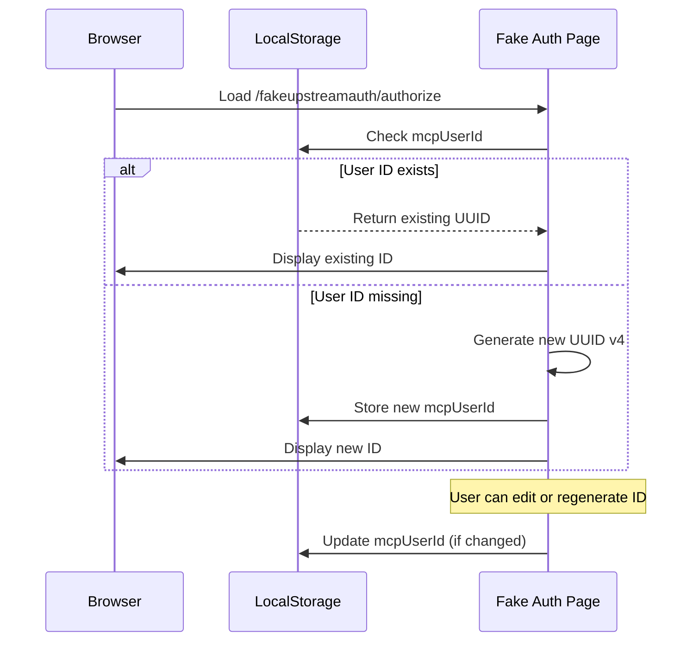
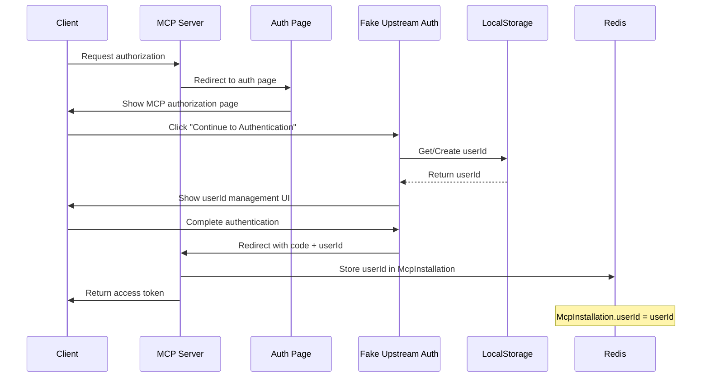
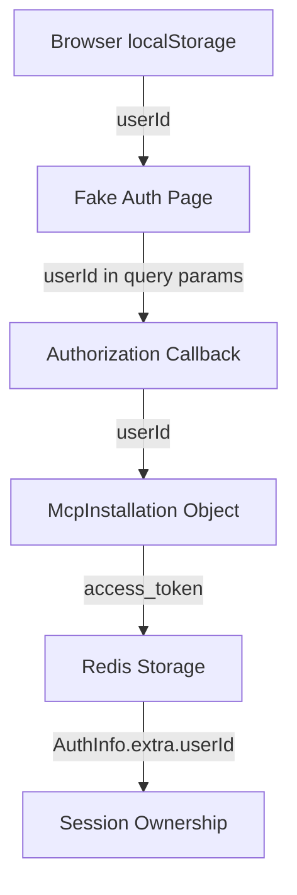
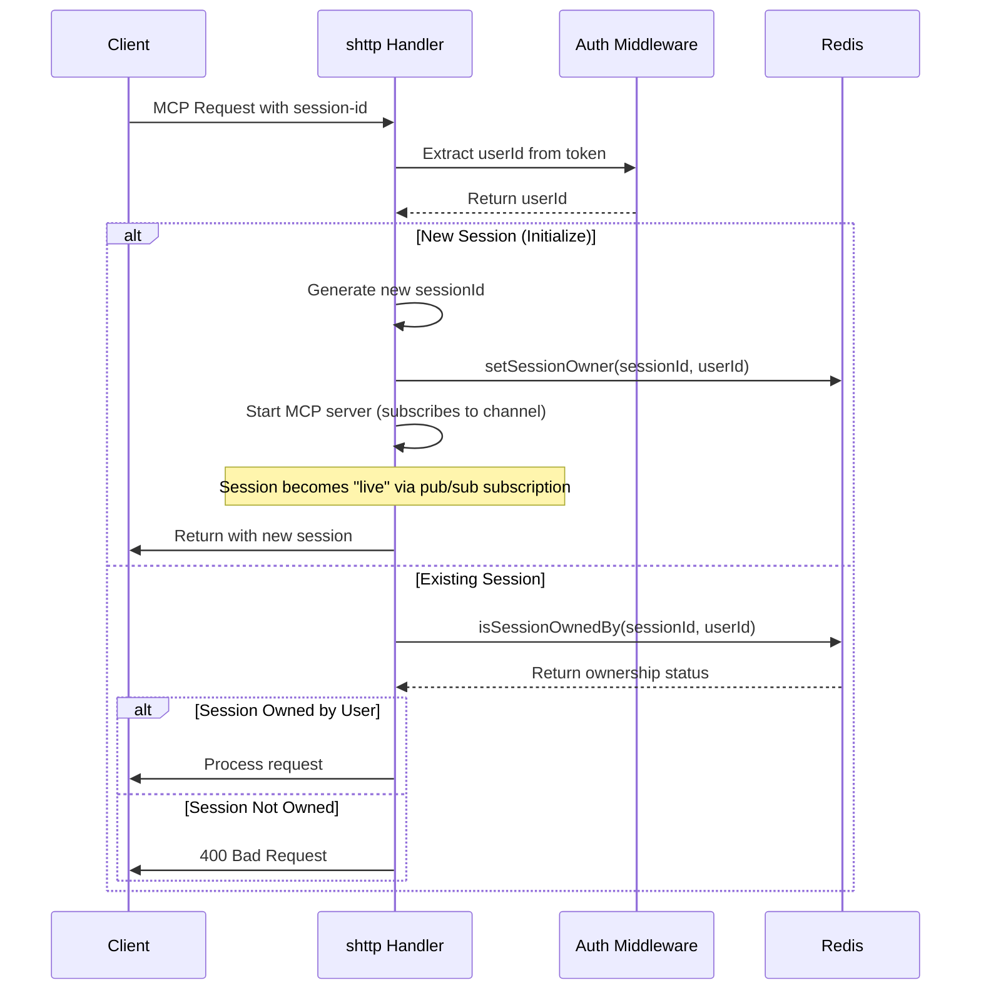
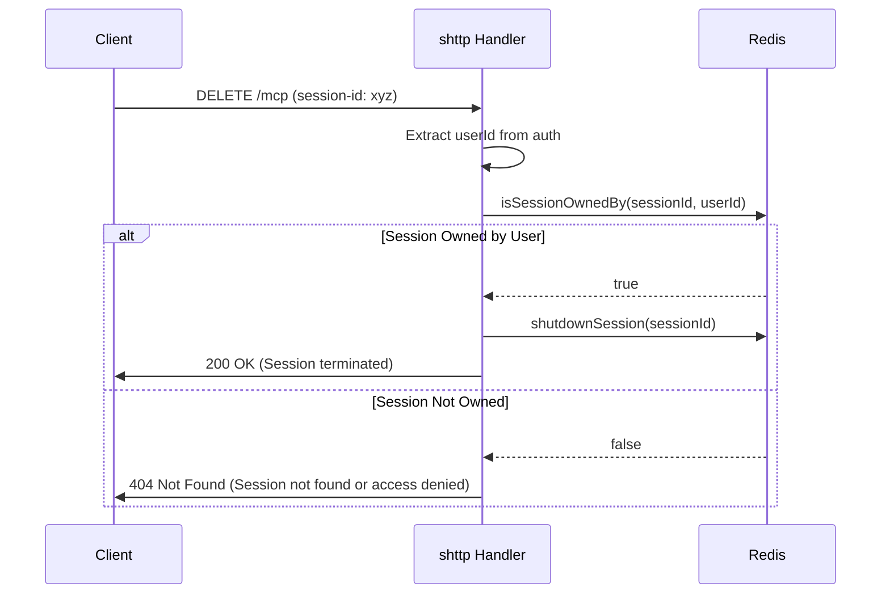
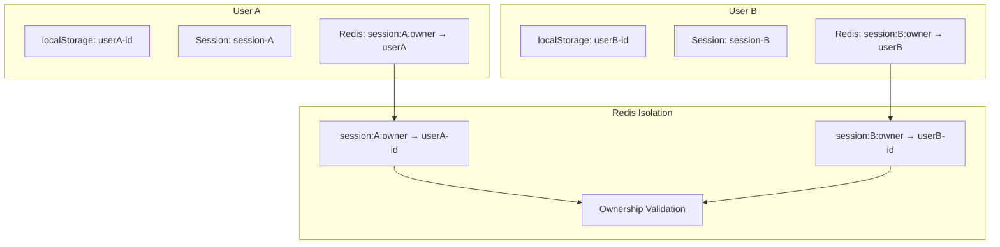

# User ID System Documentation

## Overview

The MCP server implements a comprehensive user identification and session ownership system that ensures secure multi-user access to MCP resources. This system integrates localStorage-based user management, OAuth authentication flows, and Redis-backed session isolation.

## Architecture Components

### 1. User ID Management (localStorage)
### 2. OAuth Authorization Flow
### 3. Redis Session Ownership
### 4. Session Access Validation

---

## 1. User ID Management (localStorage)

The fake upstream authentication system uses browser localStorage to manage user identities for testing and development purposes.

### localStorage Schema

```typescript
// Stored in browser localStorage
{
  "mcpUserId": "550e8400-e29b-41d4-a716-446655440000" // UUID v4
}
```

### User ID Generation Flow



### User ID Operations

| Operation | Description | Implementation |
|-----------|-------------|----------------|
| **Generate** | Create new UUID v4 | `generateUUID()` function |
| **Retrieve** | Get existing or create new | `getUserId()` function |
| **Update** | Edit existing ID | `editUserId()` function |
| **Persist** | Store in localStorage | `localStorage.setItem('mcpUserId', userId)` |

---

## 2. OAuth Authorization Flow

The OAuth flow integrates user IDs from localStorage into the MCP authorization process.

### Complete OAuth Flow with User ID



### OAuth Data Flow



### Authorization Code Exchange

The userId is embedded in the authorization flow:

```javascript
// In fake auth page
function authorize() {
  const userId = getUserId(); // From localStorage
  const url = new URL(redirectUri);
  url.searchParams.set('userId', userId);
  url.searchParams.set('code', 'fakecode');
  window.location.href = url.toString();
}
```

---

## 3. Redis Session Ownership

Redis stores session ownership information using a structured key system.

### Redis Key Structure

#### MCP Session Keys (MCP Server)
```
session:{sessionId}:owner → userId                    # Session ownership
mcp:shttp:toserver:{sessionId} → [pub/sub channel]   # Client→Server messages (also indicates liveness)
mcp:shttp:toclient:{sessionId}:{requestId} → [pub/sub channel] # Server→Client responses
mcp:control:{sessionId}   → [pub/sub channel]        # Control messages
```

#### Auth Keys (Auth Server)
```
auth:client:{clientId} → client registration          # OAuth client registrations
auth:pending:{authCode} → pending authorization       # Pending auth (10 min TTL)
auth:installation:{accessToken} → MCP installation    # Active sessions (7 days TTL)
auth:exch:{authCode} → token exchange                 # Token exchange (10 min TTL)
auth:refresh:{refreshToken} → access token            # Refresh tokens (7 days TTL)
```

Note: The `auth:` prefix ensures complete isolation from MCP session keys, allowing both integrated and separate modes to work consistently.

### Redis Operations

| Operation | Key Pattern | Value | Purpose |
|-----------|-------------|--------|---------|
| **Set Owner** | `session:{sessionId}:owner` | `userId` | Store session owner |
| **Get Owner** | `session:{sessionId}:owner` | `userId` | Retrieve session owner |
| **Check Live** | `mcp:shttp:toserver:{sessionId}` | `numsub > 0` | Check if session active via pub/sub subscribers |

### Session Liveness Mechanism

Session liveness is determined by **pub/sub subscription count** rather than explicit keys:

```mermaid
graph TD
    A[MCP Server Starts] --> B[Subscribe to mcp:shttp:toserver:sessionId]
    B --> C[numsub = 1 → Session is LIVE]
    C --> D[Session Processing]
    D --> E[MCP Server Shutdown]
    E --> F[Unsubscribe from channel]
    F --> G[numsub = 0 → Session is DEAD]
    
    H[isLive() function] --> I[Check numsub count]
    I --> J{numsub > 0?}
    J -->|Yes| K[Session is Live]
    J -->|No| L[Session is Dead]
```

**Why this works:**
- When an MCP server starts, it subscribes to `mcp:shttp:toserver:{sessionId}`
- When it shuts down (gracefully or crashes), Redis automatically removes the subscription
- `numsub` reflects the actual state without requiring explicit cleanup

### Session Ownership Functions

```typescript
// Core ownership functions
export async function setSessionOwner(sessionId: string, userId: string): Promise<void>
export async function getSessionOwner(sessionId: string): Promise<string | null>
export async function validateSessionOwnership(sessionId: string, userId: string): Promise<boolean>
export async function isSessionOwnedBy(sessionId: string, userId: string): Promise<boolean>
export async function isLive(sessionId: string): Promise<boolean> // Uses numsub count
```

---

## 4. Session Access Validation

Session access is validated at multiple points in the request lifecycle.

### Session Validation Flow



### DELETE Request Validation



### Request Authorization Matrix

| Request Type | Session ID | User ID | Authorization Check |
|-------------|-----------|---------|-------------------|
| **Initialize** | None | Required | Create new session |
| **Existing Session** | Required | Required | `isSessionOwnedBy()` |
| **DELETE Session** | Required | Required | `isSessionOwnedBy()` |

---

## 5. Security Model

### Multi-User Isolation



### Security Guarantees

1. **Session Isolation**: Users can only access sessions they own
2. **Identity Verification**: User ID is validated from authenticated token
3. **Ownership Persistence**: Session ownership is stored in Redis
4. **Access Control**: All session operations validate ownership
5. **Secure Cleanup**: DELETE operations verify ownership before termination

### Attack Prevention

| Attack Vector | Prevention | Implementation |
|---------------|------------|----------------|
| **Session Hijacking** | Ownership validation | `isSessionOwnedBy()` check |
| **Cross-User Access** | User ID verification | Extract userId from AuthInfo |
| **Session Spoofing** | Token validation | Bearer token middleware |
| **Unauthorized DELETE** | Ownership check | Validate before shutdown |

---

## 6. Implementation Details

### Error Handling

```typescript
// Session access errors
if (!userId) {
  return 401; // Unauthorized: User ID required
}

if (!await isSessionOwnedBy(sessionId, userId)) {
  return 400; // Bad Request: Session access denied
}
```

### Testing Strategy

The system includes comprehensive tests for:

- **User session isolation**: Users cannot access other users' sessions
- **DELETE request validation**: Only owners can delete sessions
- **Redis cleanup**: Proper cleanup of ownership data
- **Auth flow integration**: User ID propagation through OAuth

### Performance Considerations

1. **Redis Efficiency**: O(1) lookups for session ownership
2. **Session Reuse**: Existing sessions are reused when ownership matches
3. **Cleanup**: Automatic cleanup prevents resource leaks
4. **Caching**: Session ownership is cached in Redis

---

## 7. Configuration

### Environment Variables

```bash
# Redis configuration for session storage
REDIS_HOST=localhost
REDIS_PORT=6379
REDIS_PASSWORD=optional

# Base URI for OAuth redirects
BASE_URI=http://localhost:3000
```

### Development Testing

```bash
# Run multi-user tests
npm test -- --testNamePattern="User Session Isolation"

# Test session ownership
npm test -- --testNamePattern="session ownership"

# Full integration test
npm test
```

---

## 8. Monitoring and Debugging

### Redis Key Monitoring

```bash
# Monitor session ownership keys
redis-cli KEYS "session:*:owner"

# Watch session ownership operations
redis-cli MONITOR | grep "session:"

# Check active (live) sessions via pub/sub
redis-cli PUBSUB CHANNELS "mcp:shttp:toserver:*"
redis-cli PUBSUB NUMSUB "mcp:shttp:toserver:*"
```

### Debugging Commands

```bash
# Check session ownership
redis-cli GET "session:550e8400-e29b-41d4-a716-446655440000:owner"

# List all session owners
redis-cli KEYS "session:*:owner"

# Check if specific session is live
redis-cli PUBSUB NUMSUB "mcp:shttp:toserver:550e8400-e29b-41d4-a716-446655440000"

# Monitor pub/sub activity
redis-cli MONITOR
```

This system provides robust multi-user session management with strong security guarantees and comprehensive testing coverage.